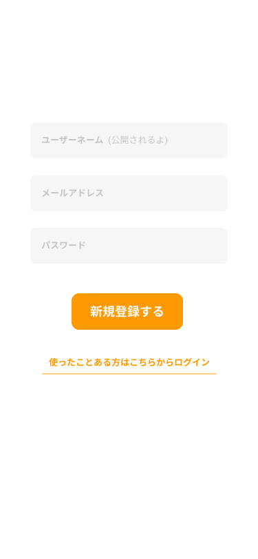
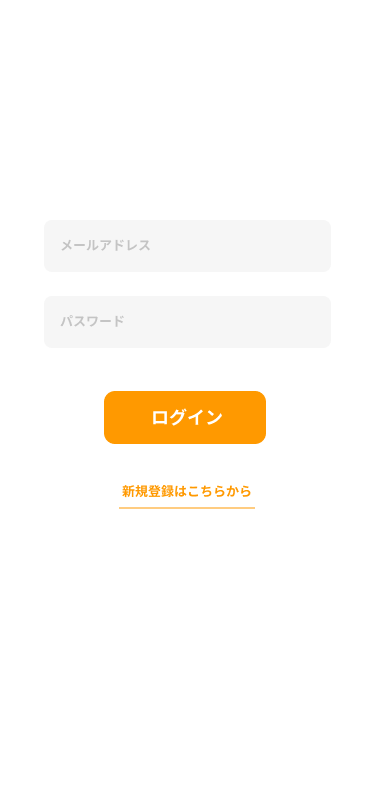
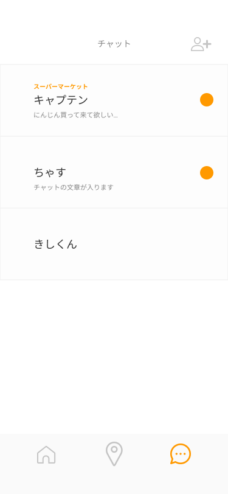
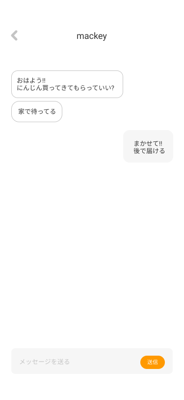

# サンプル（プロダクト名）

[](https://www.youtube.com/watch?v=G5rULR53uMk)

## 製品概要
買い物をしている友人や家族に「ついで買い」を頼む

### 背景(製品開発のきっかけ、課題等）
コロナ社会で、できれば外出を避けたいという世の中の流れがあります。
またそれ故に友達と会う機会は減少してしまっています。
私たちは、ついで買いのしやすい環境を整えることで、"外出の抑制"と"何気ない（わざわざ連絡して会う程でもない）コミュニケーションの機会"を増やします。
位置情報サービスとWebソケットを利用してリアルタイムにリクエストを飛ばすことでこれらの機能を実装します。

### 製品説明（具体的な製品の説明）

## 機能
### ユーザ
|新規登録|ログイン|
|---|---|
|||

### HOMEページ
|フレンドが買い物スポットにいるとき|自分が買い物ポイントにいるとき|自分の位置を非公開にしたとき|位置を公開、非公開にできる|
|---|---|---|---|
|.png)|Home%20(1).png)|.png)|.png)|

### スポット登録ページ
|スポットを「＋」で登録できる|特定の場所を新規で登録できる|
|---|---|
|.png)|.png)|


### チャットページ
|フレンド一覧画面|フレンドとチャットできる|
|---|---|
|||


### 解決出来ること
### 今後の展望
### 注力したこと（こだわり等）
* 
* 

## 開発技術
### 活用した技術
#### API・データ
* JS(位置情報取得) 
* 

#### フレームワーク・ライブラリ・モジュール
* 
* 

#### デバイス
* スマートフォン(位置情報を公開)
* 

### 独自技術
#### ハッカソンで開発した独自機能・技術
* 独自で開発したものの内容をこちらに記載してください
* 特に力を入れた部分をファイルリンク、またはcommit_idを記載してください。

## セットアップ

#### ①ファイルの場所を移動
```
cd react
```

#### ②package.json に書かれているライブラリを一括で読み込む

```
npm install
```

#### ライブラリのインストール

```
npm install ライブラリー名
```

#### ③ローカルでテストサーバーを立ち上げる

```
npm run start
```

#### ③ローカルでテストサーバーを立ち上げる(サブ)

```
npm run start:dev
```